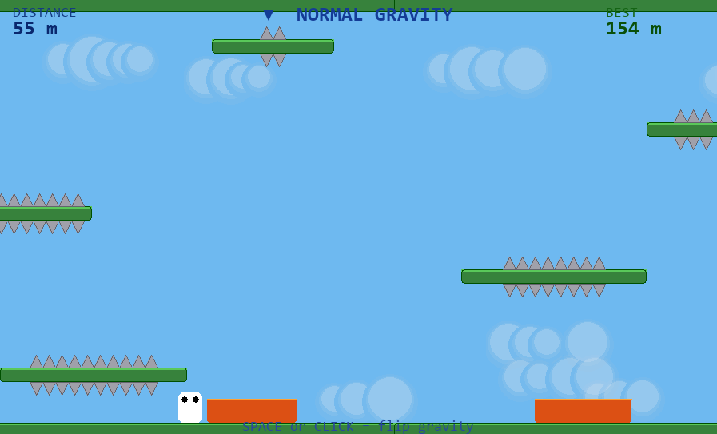

<div align="center">

# 🎮 GRAVITY FLIP

### Neon Endless Runner


A **2D auto-runner platformer** built using **Python and Pygame**.
The player runs automatically while the only control is **flipping gravity** to dodge spikes and lava.

</div>

---

## 📸 Preview

<div align="center">



</div>

---

## 🎥 Gameplay

<div align="center">


</div>

---

## 🕹️ How to Play

| Key   | Action       |
| ----- | ------------ |
| SPACE | Flip Gravity |
| ESC   | Quit Game    |

🎯 **Objective:**
Survive as long as possible while avoiding obstacles.

---

## ✨ Features

* ⚡ Gravity flip mechanic
* 🌌 Neon visual theme
* 🌗 Day → Night background transition
* 🏃 Endless runner gameplay
* 📈 Increasing difficulty

---

## ⚙️ Installation

Clone the repository

```bash
git clone https://github.com/yourusername/gravity-flip.git
cd gravity-flip
```

Install dependencies

```bash
pip install pygame
```

Run the game

```bash
python main.py
```

---

## 📁 Project Structure

```
gravity-flip/
│
├── main.py
├── assets/
│   ├── player.png
│   ├── spikes.png
│   └── background.png
│
├── screenshot.png
├── gameplay.gif
└── README.md
```

---

## 🛠️ Built With

* Python
* Pygame

---

## 👩‍💻 Author

**Navya Manoj**

Computer Science Student

---

⭐ If you like the project, consider giving it a **star on GitHub!**
